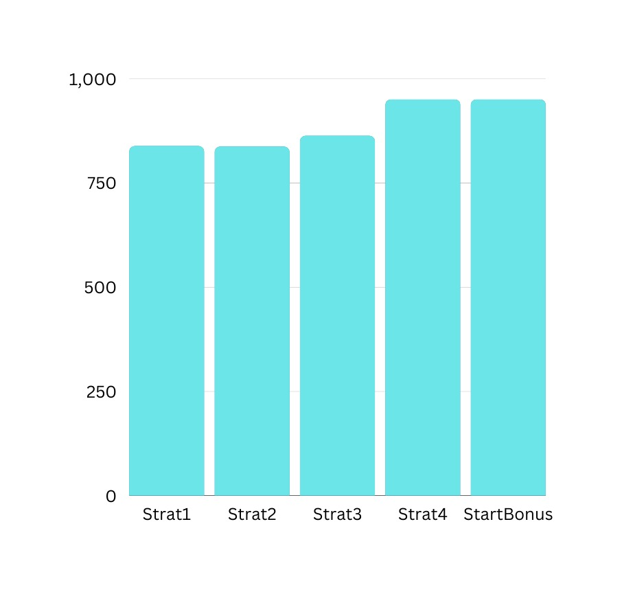
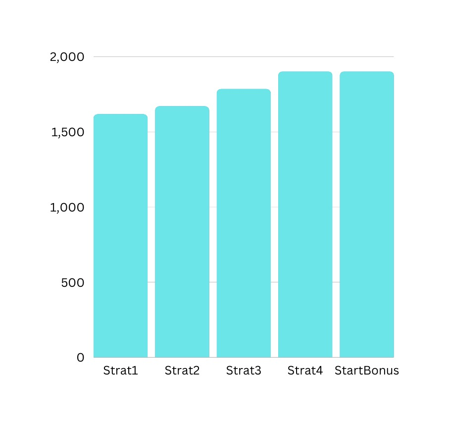
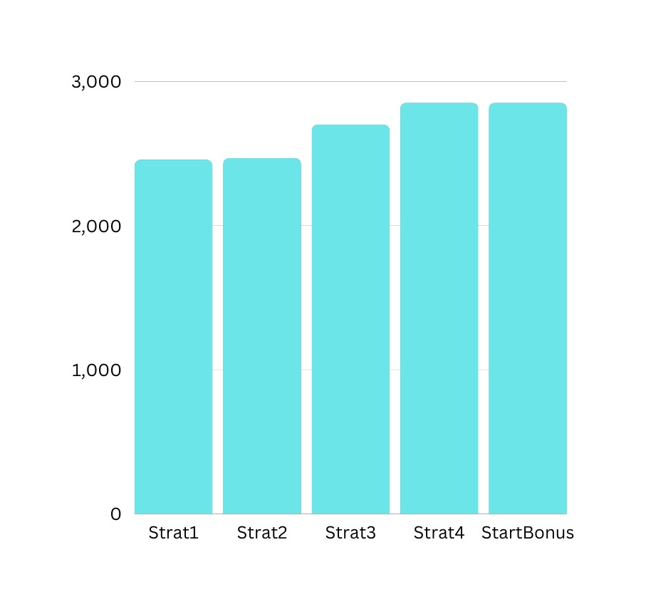
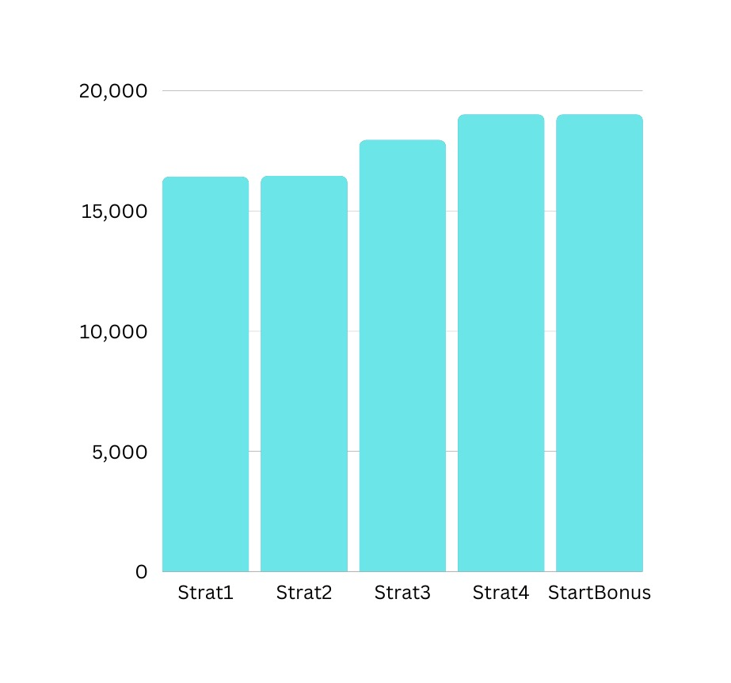

#  Greedy-Programming-Project <br>
### COT5405 Analysis of Algorithm (AOA)

### Team Members Contribution
#### <i> Lohit Bhambri (lohit.bhambri@ufl.edu) </i>
1. Implemented Strategy1
2. Implemented Strategy2
3. Implemented Strategy4
4. Implemented Strategy Bonus (equal contributor)
5. Report Compilation
6. Analysis of Algorithms (equal contributor)

#### <i> Sharath Bhushan Podila (spodila@ufl.edu) </i>
1. Implemented Strategy3
2. Implemented Strategy Bonus (equal contributor)
3. Implemented MakeFile mechanism and execution in Remote CISE Machines
4. Experimental Comparative Strategy mechanism result generation
5. Analysis of Algorithms (equal contributor)

### Strategy 1
<i>Algorithm</i>:<br>
```aidl
Algorithm strat1(timelines, n, m)
Input: 
    timelines: a list of m pairs of integers representing the painting timelines for each house
    n: an integer representing the number of days available for painting
    m: an integer representing the number of houses to paint
Output: 
    A string containing the sequence of house numbers in the order they were painted

Initialize an empty string housePaintString
Initialize a queue houseQueue to store the painting timelines for each house
For each painting timeline in timelines, add the house number to the end of the list, and add the list to houseQueue
For each day pDay from 1 to n do the following:
    a. While houseQueue is not empty do the following:
        i. Peek the first element of houseQueue and assign it to peekHouse
        ii. If the painting timeline of peekHouse covers pDay do the following:
            1. Remove peekHouse from houseQueue
            2. Append the house number of peekHouse to housePaintString
            3. Append a space to housePaintString
            4. Break the loop
        iii. Else, if the painting timeline of peekHouse has already passed pDay remove it from houseQueue and continue 
        the loop
        iv. Else, if the painting timeline of peekHouse starts after pDay break the loop
    b. If houseQueue is empty, break the loop
Return housePaintString with leading and trailing whitespaces removed
```
<i>Proof of Completion</i>:<br>
```aidl

```

<i>Proof of Correctness</i>:<br>
```aidl
Lets assume that our greedy approach generates output order as 
G = {g1, g2, g3, g4, g5 .... gN}

Lets assume that our optimal approach generates output order as 
O = {o1, o2, o3, o4, o5 .... gM}

Cardinality |O| >= |G|; therefore M>=N.
Lets assume till (k-1), both greedy and optimal approaches are producing the same output.
At kth point we have conflict.
Since our greedy approach is picking the earlist listing, we can state that gK.startDay <= oK.startDay.
Therefore we will start-replacing gK with oK inside (0) set via exchange argument.

Our updated optimal (0) set will be 
0 = {o1,o2,o3,o4...oK-1,gk,gk+1,gk+2,gk+3...gN,oN+1,oN+2...,oM}
Therefore our greedy will become optimal is M=N strictly.
```

<i>Time Complexity Analysis</i>:<br>
```
For each pDay ranging from (1..n) we are checking if the the head of the queue's startDay and endDay are following 
within threshold criteria or not. If yes, we are paining removing the head pair from the queue & painting the house else
we are just removing the pair from the queue. Since we cannot exceed the (n) buffer, our algorithm will be linear
Time Complexity: O(n)
```

### Strategy 2
<i>Algorithm:</i><br>
```aidl
Algorithm strat2(timelines, n, m)
Input: 
    timelines: a list of m pairs of integers representing the painting timelines for each house
    n: an integer representing the number of days available for painting
    m: an integer representing the number of houses to paint
Output: 
    A string containing the sequence of house numbers in the order they were painted

Initialize an empty string housePaintString
Initialize a priority queue latestHouses to store the painting timelines for each house, sorted by decreasing start day 
and increasing end day

Initialize housePtr to 0
For each day pDay from 1 to n do the following:
    a. While housePtr < m do the following:
        i. Peek the house timeline at index housePtr in timelines and assign it to pair
        ii. If the start day of pair equals pDay do the following:
            Add the index of the house (housePtr+1) to the end of pair
            Add pair to latestHouses
            Increment housePtr by 1
        iii. Else, break the loop
    b. If latestHouses is empty, continue the loop
    c. While latestHouses is not empty do the following:
        i. Peek the first element of latestHouses and assign it to peekHouse
        ii. If pDay is between the start and end days of peekHouse do the following:
            Remove peekHouse from latestHouses
            Append the house number of peekHouse to housePaintString
            Append a space to housePaintString
            Break the loop
        iii. Else, if pDay is greater than the end day of peekHouse remove it from latestHouses and continue the loop
        iv. Else, if pDay is less than the start day of peekHouse, break the loop
Return housePaintString with leading and trailing whitespaces removed
```
<i>Proof of Completion</i>:<br>
```aidl

```
<i>Proof of Correctness</i>:<br>
```aidl
Lets assume that our greedy approach generates output order as 
G = {g1, g2, g3, g4, g5 .... gN}

Lets assume that our optimal approach generates output order as 
O = {o1, o2, o3, o4, o5 .... gM}

Cardinality |O| >= |G|; therefore M>=N.
Lets assume till (k-1), both greedy and optimal approaches are producing the same output.
At kth point we have conflict.
Since our greedy approach is picking the latest listing i.e. latest start day (maximum), we can state that 
gK.startDay >= oK.startDay.
Therefore we will start-replacing gK with oK inside (G) set via exchange argument.

Our updated greedy (G) set will be 
G = {g1,g2,g3,g4...gK-1,ok,ok+1,ok+2,ok+3...oN}

Therefore our greedy will become optimal is M=N strictly.
```
<i>Time Complexity Analysis</i>:<br>
```
For each pDay ranging from (1..n) we are checking if there is an available listing for that day or not. If yes, we are
adding it to priority-queue (aka max-heap) and extracting the earliest available listing. If that listing is satisfying
the threshold, we are painting that house.
Time Complexity: O(n+logm)
```

### Strategy 3
<i>Algorithm</i>:
```aidl
Algorithm strat3(timelines, n, m)
Input: 
    timelines: a list of m pairs of integers representing the painting timelines for each house 
    n: an integer representing the number of days available for painting 
    m: an integer representing the number of houses to paint
Output: 
    A string containing the sequence of house numbers in the order they were painted

Initialize an empty string housePaintString
Initialize a priority queue latestHouses to store the painting timelines for each house

The priority queue latestHouses is sorted based on the duration of the painting timeline, and if the duration is the 
same, based on the end date of the painting timeline

Initialize housePtr to 0
For each day pDay from 1 to n do the following:
    a. If pDay is greater than 1, do the following:
        i. Initialize an empty list previousBuffer
        ii. While latestHouses is not empty do the following:
            Remove the head of latestHouses and assign it to priorityQueueHead
            Decrement the duration of priorityQueueHead by 1
            If the duration of priorityQueueHead is still greater than or equal to 0, add it to previousBuffer and 
            continue the loop
        iii. For each painting timeline in previousBuffer, add it back to latestHouses
    b. While housePtr is less than m and the start date of the painting timeline at housePtr is equal to pDay do the 
    following:
        i. Create a list pair consisting of the painting timeline at housePtr, the duration of the painting timeline, 
        and the house number
        ii. Add pair to latestHouses
        iii. Increment housePtr by 1
    c. If latestHouses is empty, continue to the next iteration of the loop
    d. While latestHouses is not empty do the following:
        i. Peek the head of latestHouses and assign it to peekHouse
        ii. If the painting timeline of peekHouse covers pDay do the following:
            Remove peekHouse from latestHouses
            Append the house number of peekHouse to housePaintString
            Append a space to housePaintString
            Break the loop
        iii. Else, if the painting timeline of peekHouse has already passed pDay remove it from latestHouses and 
        continue the loop
        iv. Else, if the painting timeline of peekHouse starts after pDay break the loop
Return housePaintString with leading and trailing whitespaces removed
```
<i>Proof of Completion</i>:<br>
```aidl

```
<i>Proof of Correctness</i>:<br>
```
Lets assume that our greedy approach generates output order as 
G = {g1, g2, g3, g4, g5 .... gN}

Lets assume that our optimal approach generates output order as 
O = {o1, o2, o3, o4, o5 .... gM}

Cardinality |O| >= |G|; therefore M>=N.
Lets assume till (k-1), both greedy and optimal approaches are producing the same output.
At kth point we have conflict.
Since our greedy approach is picking the listing with minimum duration, we can state that 
gK.duration <= oK.duration.
Therefore we will start-replacing gK with oK inside (O) set via exchange argument.

Our updated greedy (G) set will be 
O = {o1,o2,o3,o4...oK-1,gk,gk+1,gk+2,gk+3...gN,oN+1,oN+2...,oM}

Therefore our greedy will become optimal is M=N strictly.
```
<i>Time Complexity Analysis</i>:<br>
```
For each pDay ranging from (1..n) we are checking if there is an available listing for that day or not. If yes, we are
adding it to priority-queue (aka min-heap) by calculating the duration and extracting the listing with minimum duration. 
If that listing is satisfying the threshold, we are painting that house.
Time Complexity: O(n+logm)
```

### Strategy 4
<i>Algorithm</i>:
```aidl
Algorithm strat4(timelines, n, m)
Input: 
    timelines: a list of m pairs of integers representing the painting timelines for each house
    n: an integer representing the number of days available for painting
    m: an integer representing the number of houses to paint
Output: 
    A string containing the sequence of house numbers in the order they were painted

Initialize an empty string housePaintString

Initialize a priority queue latestHouses to store the painting timelines for each house, with a custom comparator 
function that compares based on the end date and then the start date of the painting timeline

Initialize housePtr to 0
For each day pDay from 1 to n do the following:
    a. While housePtr is less than m and the start date of the painting timeline at housePtr is equal to pDay, do the 
    following:
        i. Add the house number (housePtr+1) to the end of the painting timeline at housePtr
        ii. Add the painting timeline at housePtr to latestHouses
        iii. Increment housePtr by 1
    b. If latestHouses is empty, continue the loop
    c. While latestHouses is not empty, do the following:
        i. Peek the first element of latestHouses and assign it to peekHouse
        ii. If the painting timeline of peekHouse covers pDay do the following:
            1. Remove peekHouse from latestHouses
            2. Append the house number of peekHouse to housePaintString
            3. Append a space to housePaintString
            4. Break the loop
        iii. Else, if the painting timeline of peekHouse has already passed pDay remove it from latestHouses and 
        continue the loop
        iv. Else, if the painting timeline of peekHouse starts after pDay break the loop
Return housePaintString with leading and trailing whitespaces removed
```
<i>Proof of Completion</i>:<br>
```aidl

```
<i>Proof of Correctness</i>:<br>
```
Lets assume that our greedy approach generates output order as 
G = {g1, g2, g3, g4, g5 .... gN}

Lets assume that our optimal approach generates output order as 
O = {o1, o2, o3, o4, o5 .... gM}

Cardinality |O| >= |G|; therefore M>=N.
Lets assume till (k-1), both greedy and optimal approaches are producing the same output.
At kth point we have conflict.
Since our greedy approach is picking the listing with minimum endDate, we can state that 
gK.endDate <= oK.endDate.
Therefore we will start-replacing gK with oK inside (O) set via exchange argument.

Our updated greedy (G) set will be 
O = {o1,o2,o3,o4...oK-1,gk,gk+1,gk+2,gk+3...gN,oN+1,oN+2...,oM}

Therefore our greedy will become optimal is M=N strictly.
```

<i>Time Complexity Analysis</i>:<br>
```
For each pDay ranging from (1..n) we are checking if there is an available listing for that day or not. If yes, we are
adding it to priority-queue (aka max-heap) extracting the listing with earliest end date.If that listing is satisfying 
the threshold, we are painting that house.
Time Complexity: O(n+logm)
```

### Strategy Bonus
<i>Algorithm</i>:
```aidl
Algorithm stratBonus(timelines, n, m)
Input:
    timelines: a list of m pairs of integers representing the painting timelines for each house
    n: an integer representing the number of days available for painting
    m: an integer representing the number of houses to paint
Output: 
    A string containing the sequence of house numbers in the order they were painted

Initialize an empty string housePaintString to store the sequence of house numbers in the order they were painted.

Initialize a priority queue latestHouses to store the painting timelines for each house in the order of their completion
time, with the house that finishes painting first being at the front of the queue. Each element in the queue is an 
ArrayList with three integers: the start time, the end time, and the house number.

Initialize a variable housePtr to keep track of the current house being processed in timelines.

For each day pDay from 1 to n do the following:
    a. While housePtr is less than m and the start time of the house at housePtr in timelines is equal to pDay, do the 
    following:
        i. Create an ArrayList pair containing the start time, end time, and house number.
        ii. Add the house number to pair and add pair to latestHouses.
        iii. Increment housePtr.
    b. If latestHouses is empty and housePtr is less than m:
        Set pDay to the start time of the house at housePtr in timelines minus 1, 
        Continue to the next iteration of the loop.
    c. While latestHouses is not empty, do the following:
            i. Peek the first element of latestHouses and assign it to peekHouse.
            ii. If pDay is between the start time and end time (inclusive) of peekHouse, do the following:
                1. Remove peekHouse from latestHouses.
                2. Append the house number of peekHouse to housePaintString.
                3. Append a space to housePaintString.
                4. Break the loop.
            iii. Else, if the end time of peekHouse is less than pDay, remove peekHouse from latestHouses and continue 
            the loop.
            iv. Else, if the start time of peekHouse is greater than pDay, break the loop.
Return housePaintString with leading and trailing whitespaces removed.
```
<i>Proof of Completion</i>:<br>
```aidl

```
<i>Proof of Correctness</i>:<br>
```
Lets assume that our greedy approach generates output order as 
G = {g1, g2, g3, g4, g5 .... gN}

Lets assume that our optimal approach generates output order as 
O = {o1, o2, o3, o4, o5 .... gM}

Cardinality |O| >= |G|; therefore M>=N.
Lets assume till (k-1), both greedy and optimal approaches are producing the same output.
At kth point we have conflict.
Since our greedy approach is picking the listing with minimum duration, we can state that 
gK.duration <= oK.duration.
Therefore we will start-replacing gK with oK inside (O) set via exchange argument.

Our updated greedy (G) set will be 
O = {o1,o2,o3,o4...oK-1,gk,gk+1,gk+2,gk+3...gN,oN+1,oN+2...,oM}

Therefore our greedy will become optimal is M=N strictly.
```
<i>Time Complexity Analysis</i>:<br>
```
For each pDay ranging from (1..n) we are checking if there is an available listing for that day or not. If yes, we are
adding it to priority-queue (aka max-heap) extracting the listing with earliest end date.If that listing is satisfying 
the threshold, we are painting that house. Additionally, if our priority-queue is empty, and we have the next avaialble
listing startDay way ahead i.e. startDay of new listing > pday, we will update our pDay to the next available startDay
and continue the processing in a similar way
Time Complexity: O(m+logm)
```

### Tabular Experimental Analysis for the strategies
<p>
n = 1000 & m = 950<br>

</p>

<p>
n = 2000 & m = 1900<br>

</p>

<p>
n = 3000 & m = 2850<br>

</p>

<p>
n = 4000 & m = 3800<br>

</p>

<p>
n = 5000 & m = 4750<br>

</p>

<p>
n = 20000 & m = 19000<br>

</p>


